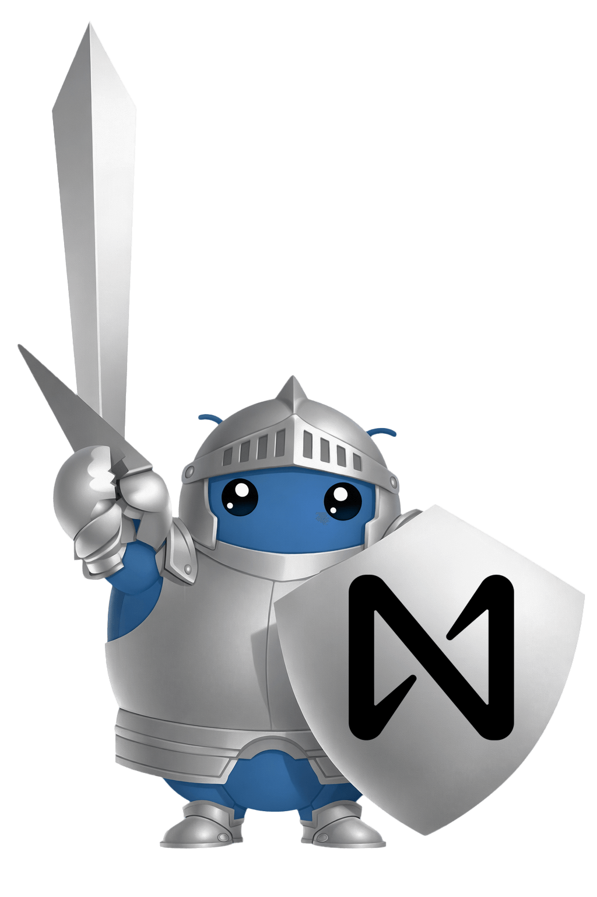

<p align="center">
  <a href="https://github.com/nearai/ironclaw"></a>
  &nbsp;&nbsp;&nbsp;&nbsp;
  <a href="https://cursor.sh"></a>
</p>

<h1 align="center">ironclaw-cursor-brain</h1>

<p align="center">
  Use <a href="https://cursor.sh">Cursor</a> as an OpenAI-compatible LLM backend for <a href="https://github.com/nearai/ironclaw">Ironclaw</a>.
</p>

<p align="center">
  <a href="README.zh-CN.md">简体中文</a>
  &nbsp;·&nbsp;
  <a href="https://github.com/nearai/ironclaw">Ironclaw</a>
  &nbsp;·&nbsp;
  <a href="https://www.rust-lang.org"></a>
  &nbsp;·&nbsp;
  <a href="https://crates.io/crates/ironclaw-cursor-brain"></a>
  &nbsp;·&nbsp;
  <a href="https://crates.io/crates/ironclaw-cursor-brain"></a>
  &nbsp;·&nbsp;
  
  &nbsp;·&nbsp;
  <a href="LICENSE"></a>
</p>

---

**ironclaw-cursor-brain** is an OpenAiCompletions provider for [Ironclaw](https://github.com/nearai/ironclaw). It wraps the Cursor Agent (subprocess) as an OpenAI Chat Completions–compatible HTTP service. Add one entry to `~/.ironclaw/providers.json` and use it like built-in providers (groq, openai) — no Ironclaw source changes.

## Features

- **OpenAI-compatible API** — `POST /v1/chat/completions` with streaming (SSE) and non-streaming
- **Session continuity** — Same `X-Session-Id` resumes Cursor conversations; mappings persisted under `~/.ironclaw/`
- **Zero config by default** — Optional `~/.ironclaw/cursor-brain.json`; env vars override
- **Cross-platform** — Windows, macOS, Linux (Rust + cursor-agent)

**Behavior vs OpenAiCompletions:** The plugin sends the **full conversation** to cursor-agent as a single synthesized prompt (System / User / Assistant / Tool result blocks). cursor-agent only accepts one prompt (stdin); `tools` / `tool_choice` are accepted in the request but not sent to the agent. See [doc/ironclaw-provider-contract.md](doc/ironclaw-provider-contract.md) for details.

## Table of contents

- [Quick start](#quick-start)
- [Documentation](#documentation)
- [Installation](#installation)
- [Configuration](#configuration)
- [Run & validate](#run--validate)
- [Register as Ironclaw provider](#register-as-an-ironclaw-provider)
- [Session continuity](#session-continuity-optional)
- [API](#api)
- [License & references](#license-and-references)

## Documentation

- **[Architecture](doc/ARCHITECTURE.md)** — Component overview, request flow, module roles (with Mermaid diagrams).
- **[Ironclaw provider contract](doc/ironclaw-provider-contract.md)** — How Ironclaw calls the plugin; request/response contract.
- **[Provider definition](doc/provider-definition.json)** — JSON entry for `~/.ironclaw/providers.json`.

## Quick start

If you already have [Rust](https://rustup.rs), [Cursor](https://cursor.com) (for cursor-agent), and [Ironclaw](https://github.com/nearai/ironclaw) set up:

```bash
cargo install ironclaw-cursor-brain
ironclaw-cursor-brain
```

Add a [provider entry](#register-as-an-ironclaw-provider) to `~/.ironclaw/providers.json` (or `%USERPROFILE%\.ironclaw\providers.json` on Windows), then use the Cursor backend from Ironclaw.

## Installation

**Requirements:** [Rust](https://rustup.rs) (stable), [cursor-agent](https://cursor.com) (from Cursor or PATH). For the full stack, install in order: PostgreSQL 15+ with pgvector, Ironclaw, then this plugin. Steps below cover Windows, macOS, and Linux.

### PostgreSQL 15+ and pgvector

Ironclaw requires PostgreSQL 15+ and the [pgvector](https://github.com/pgvector/pgvector) extension.

- **Windows**: Install [PostgreSQL](https://www.postgresql.org/download/windows/) 15+ (e.g. EDB installer). Then install pgvector: ensure Visual Studio Build Tools and `pg_config` (from the PostgreSQL bin directory) are on PATH, clone [pgvector](https://github.com/pgvector/pgvector), then run `nmake /F Makefile.win` and `nmake /F Makefile.win install` in the pgvector directory. Restart PostgreSQL.
- **macOS**: `brew install postgrest@15` (or download App from https://postgresapp.com/downloads.html). Install pgvector: `brew install pgvector` if available, or clone [pgvector](https://github.com/pgvector/pgvector) and run `make && make install` (ensure `pg_config` is on PATH). Start PostgreSQL (e.g. `brew services start postgresql@15`).
- **Linux**: Install PostgreSQL 15+ via your distro (e.g. `sudo apt install postgresql-15` on Debian/Ubuntu, or [PostgreSQL docs](https://www.postgresql.org/download/linux/)). Then clone [pgvector](https://github.com/pgvector/pgvector) and run `make && sudo make install`. Start the PostgreSQL service.

**One-time database setup** (for Ironclaw):

```bash
createdb ironclaw
psql ironclaw -c "CREATE EXTENSION IF NOT EXISTS vector;"
```

See [Ironclaw README](https://github.com/nearai/ironclaw/blob/staging/README.zh-CN.md) for more detail.

### Ironclaw

- **Windows**: Download the [Windows installer (MSI)](https://github.com/nearai/ironclaw/releases/latest/download/ironclaw-x86_64-pc-windows-msvc.msi) and run it, or use the PowerShell script: `irm https://github.com/nearai/ironclaw/releases/latest/download/ironclaw-installer.ps1 | iex`
- **macOS / Linux**: Run the shell installer: `curl --proto '=https' --tlsv1.2 -LsSf https://github.com/nearai/ironclaw/releases/latest/download/ironclaw-installer.sh | sh`, or install via Homebrew: `brew install ironclaw`. Alternatively, clone the [Ironclaw repo](https://github.com/nearai/ironclaw) and run `cargo build --release`.

Then run `ironclaw onboard` to configure database and auth. See [Ironclaw Releases](https://github.com/nearai/ironclaw/releases) and [README](https://github.com/nearai/ironclaw/blob/staging/README.zh-CN.md).

### This plugin (ironclaw-cursor-brain)

- **All platforms**: Install from [crates.io](https://crates.io/crates/ironclaw-cursor-brain): `cargo install ironclaw-cursor-brain`. The binary is installed to your Cargo `bin` directory (usually on PATH). Ensure **cursor-agent** is available (install [Cursor](https://cursor.com) or put the agent binary on PATH). To build from source: `git clone https://github.com/nearai/ironclaw-cursor-brain.git && cd ironclaw-cursor-brain && cargo build --release`.

## Configuration

**Plugin configuration reuses Ironclaw’s layout:** all config lives under the same base directory as Ironclaw (same resolution as Ironclaw: **dirs** crate — `~/.ironclaw/` on macOS/Linux, user profile on Windows). Optional plugin config file: `cursor-brain.json` in that directory. Provider registration is done via `providers.json` in the same directory (same as Ironclaw’s built-in providers). After running `ironclaw onboard`, add this plugin’s provider entry to that file (see “Register as an Ironclaw provider” below).

- **Source**: Environment variables first; optional file `~/.ironclaw/cursor-brain.json` (env overrides file).
- **Options**:
  - `cursor_path`: Path to cursor-agent; unset = detect from PATH or platform paths
  - `port`: Listen port, default **3001** (Ironclaw convention: Web Gateway 3000 + 1)
  - `request_timeout_sec`: Per-request timeout (seconds), default 300
  - `session_cache_max`: Session mapping LRU capacity, default 1000
  - `session_header_name`: HTTP header name for external session id, default `x-session-id` (e.g. `X-Session-Id`)
  - `default_model`: Default model when request omits `model`; unset = `"auto"`
  - `fallback_model`: If primary model returns no content, retry once with this model (non-stream only)

Env vars: `CURSOR_PATH`, `PORT` or `IRONCLAW_CURSOR_BRAIN_PORT`, `REQUEST_TIMEOUT_SEC`, `SESSION_CACHE_MAX`, `SESSION_HEADER_NAME`, `CURSOR_BRAIN_DEFAULT_MODEL`, `CURSOR_BRAIN_FALLBACK_MODEL`.

- **Log level**: Set **`RUST_LOG`** (default `info` if unset). Examples: `RUST_LOG=debug ironclaw-cursor-brain` or `RUST_LOG=ironclaw_cursor_brain=debug,tower_http=info` to raise only this crate to debug. Levels: `error`, `warn`, `info`, `debug`, `trace`.

Session mappings are always persisted to `~/.ironclaw/cursor-brain-sessions.json` (fixed path, not configurable).

## Run & validate

```bash
ironclaw-cursor-brain   # listens on http://0.0.0.0:3001 (or cargo run if built from source)
```

In another terminal:

```bash
curl http://127.0.0.1:3001/v1/health
curl -X POST http://127.0.0.1:3001/v1/chat/completions \
  -H "Content-Type: application/json" \
  -d '{"model":"cursor-default","messages":[{"role":"user","content":"hi"}],"stream":false}'
```

**If you see 503 "cursor-agent returned no content":** The plugin logs cursor-agent stderr (`cursor_agent_stderr`). The plugin maps request model `cursor` to `auto` for cursor-agent. If Ironclaw logs **"Failed to parse user providers.json"**, set `protocol` to `"open_ai_completions"` (snake_case), not `OpenAiCompletions`.

## Register as an Ironclaw provider

Ironclaw **has no separate manifest or installer** for third-party providers. The only way to register is to add one full **ProviderDefinition** object to the JSON array in **`~/.ironclaw/providers.json`**. That file is merged with Ironclaw’s built-in `providers.json` at load time.

- **How does it show up in the config flow?** The definition must include the **`setup`** field. The wizard only shows providers that have `setup`; entries without it do not appear in the “Choose LLM provider” list.
- **What does `setup.can_list_models: true` do?** In the “Select model” step, Ironclaw calls the provider’s **GET /v1/models** (using `default_base_url`) and shows the returned list for the user to pick from. This plugin implements that endpoint (via `cursor-agent --list-models`), so `can_list_models` should be `true`.
- **Who sets it, where is it stored?** The **user** adds the entry by editing `~/.ironclaw/providers.json` locally; it lives only in that file.

If the file does not exist (e.g. right after `ironclaw onboard`), create it with content `[]`, then **merge** the entry below into that array. Do not omit the required `model_env` or **`setup`** or the provider won’t appear in the wizard or may fail to parse. After that you can choose **Cursor Brain** in the LLM step and pick a model from the list in the next step.

### Field reference

| Field             | Required | Description                                                                                                                                                                                                     |
| ----------------- | -------- | --------------------------------------------------------------------------------------------------------------------------------------------------------------------------------------------------------------- |
| id                | ✓        | Unique id for `LLM_BACKEND`, e.g. `"cursor"`                                                                                                                                                                    |
| protocol          | ✓        | Must be `"open_ai_completions"` (snake_case)                                                                                                                                                                    |
| model_env         | ✓        | Env var name for model, e.g. `"CURSOR_BRAIN_MODEL"`; required by Ironclaw                                                                                                                                       |
| default_model     | ✓        | Default model, use `"auto"` for cursor-agent                                                                                                                                                                    |
| description       | ✓        | One-line description for UI                                                                                                                                                                                     |
| aliases           |          | Aliases for `LLM_BACKEND`, e.g. `["cursor_brain","cursor-brain"]`                                                                                                                                               |
| default_base_url  |          | Default service URL (include `/v1`), e.g. `http://127.0.0.1:3001/v1`                                                                                                                                            |
| base_url_env      |          | Env var to override base URL, e.g. `"CURSOR_BRAIN_BASE_URL"`                                                                                                                                                    |
| base_url_required |          | Whether base URL is required; use `false` for this plugin                                                                                                                                                       |
| api_key_required  |          | Whether API key is required; use `false` for this plugin                                                                                                                                                        |
| setup             |          | **Required to be installable.** Wizard hint; `kind: "open_ai_compatible"` shows “Cursor Brain” and asks for Base URL; `can_list_models: true` makes the wizard call GET /v1/models so the user can pick a model |

### Full example (recommended)

You can copy the object from [doc/provider-definition.json](doc/provider-definition.json) and merge it into your existing `~/.ironclaw/providers.json` array; or use this full JSON (if the file already exists, merge only the `{ ... }` object into the array):

```json
{
  "id": "cursor",
  "aliases": ["cursor_brain", "cursor-brain"],
  "protocol": "open_ai_completions",
  "default_base_url": "http://127.0.0.1:3001/v1",
  "base_url_env": "CURSOR_BRAIN_BASE_URL",
  "base_url_required": false,
  "api_key_required": false,
  "model_env": "CURSOR_BRAIN_MODEL",
  "default_model": "auto",
  "description": "Cursor Agent via ironclaw-cursor-brain (local OpenAI-compatible proxy)",
  "setup": {
    "kind": "open_ai_compatible",
    "secret_name": "llm_cursor_brain_api_key",
    "display_name": "Cursor Brain",
    "can_list_models": true
  }
}
```

### Install, configure, use

- **Install**: Start this service first (`ironclaw-cursor-brain` if installed via crates.io, or `cargo run` / release binary from source); it listens on `http://127.0.0.1:3001` by default.
- **Configure**: Run `ironclaw onboard` and choose **Cursor Brain** in the LLM step; the wizard will ask for Base URL—press Enter to use the default `http://127.0.0.1:3001/v1`, or enter another host/port. No API key needed.
- **Use**: Set `LLM_BACKEND=cursor` (or `cursor_brain`). Optional env: `CURSOR_BRAIN_BASE_URL`, `CURSOR_BRAIN_MODEL`.

After that, Ironclaw uses this service like other OpenAiCompletions providers; default port 3001 follows the Ironclaw convention (Web Gateway 3000 + 1).

## Session continuity (optional)

Send the configured session header (default `X-Session-Id`) with the same value on each request; the service keeps an "external session id → cursor session_id" mapping (in-process LRU, capacity configurable). The next request with the same session uses `--resume` to continue the conversation. If a resume returns no content, the mapping is cleared and one retry without resume is done.

The mapping is persisted to `~/.ironclaw/cursor-brain-sessions.json` (temp file + rename on each write). Keep that file across restarts to preserve sessions.

## API

| Endpoint                    | Description                                                          |
| --------------------------- | -------------------------------------------------------------------- |
| `POST /v1/chat/completions` | OpenAI-style body; supports `stream: true` (SSE) and `stream: false` |
| `GET /v1/models`            | Model list (see below)                                               |
| `GET /v1/health`            | Health and cursor availability                                       |

**GET /v1/models**: Returns the list of model ids this service supports. Ironclaw calls this when configuring the LLM and shows the list in the wizard so the user can **select** which model to use for Cursor. **The list is queried from cursor-agent** by running `cursor-agent --list-models` on each request; **it is not configured or stored anywhere**. If the agent is unavailable or the query times out (~15s), the default list `["auto", "cursor-default"]` is returned.

`temperature` and `max_tokens` are parsed but not forwarded to cursor-agent (it uses its own defaults).

## License and references

- **License:** [LICENSE](LICENSE) (MIT).
- **Contributing:** [CONTRIBUTING.md](CONTRIBUTING.md).
- **Architecture:** [doc/ARCHITECTURE.md](doc/ARCHITECTURE.md).
- Implementation reference: [openclaw-cursor-brain](https://github.com/openclaw/openclaw-cursor-brain) (cursor-agent wrapping, stream-json).
- Integration with Ironclaw is via the provider registry only; no OpenClaw concepts.
