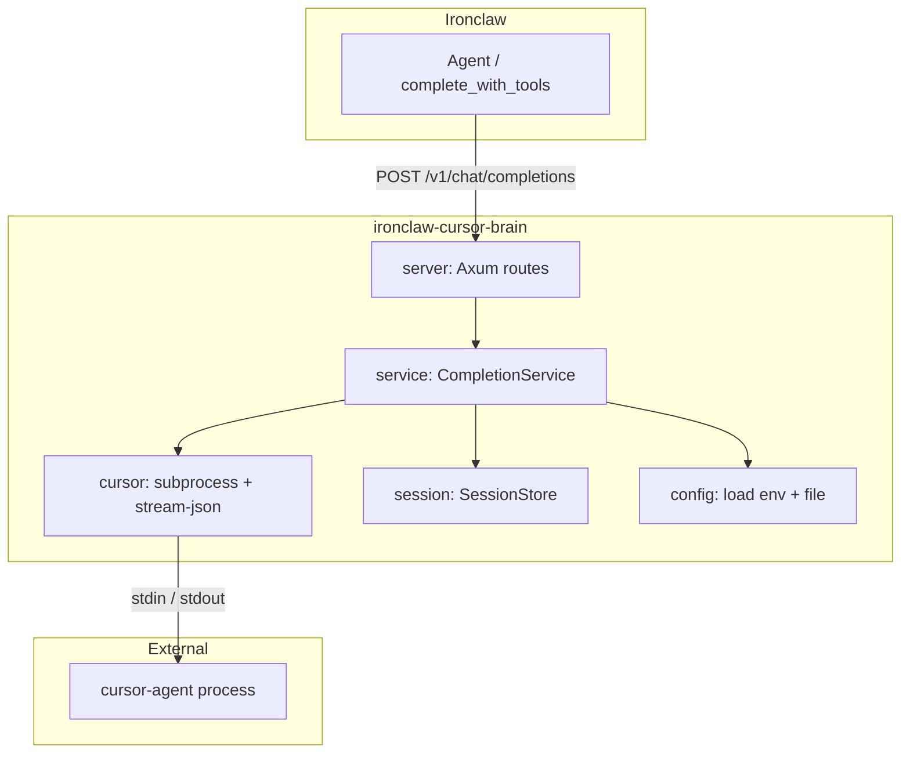
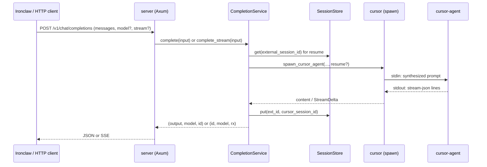

# Architecture

ironclaw-cursor-brain is a Rust HTTP service that exposes the Cursor Agent as an OpenAI-compatible API for [Ironclaw](https://github.com/nearai/ironclaw).

## Component overview

## Request flow

## Module roles

| Module      | Role                                                                                                                                  |
| ----------- | ------------------------------------------------------------------------------------------------------------------------------------- |
| **main**    | Load config, bind server, graceful shutdown                                                                                           |
| **server**  | Axum routes: `POST /v1/chat/completions`, `GET /v1/models`, `GET /v1/health`; map `CompletionError` to HTTP                           |
| **service** | Build `CompletionInput` from request; resolve session; spawn via cursor; retry (no-content, fallback model); return output            |
| **cursor**  | Spawn cursor-agent subprocess; write prompt to stdin; parse stream-json from stdout; `run_to_completion` / `run_to_completion_stream` |
| **session** | `SessionStore`: external id ↔ cursor session id; `PersistentSessionStore` = LRU + JSON file under `~/.ironclaw/`                      |
| **config**  | Load from env then optional `~/.ironclaw/cursor-brain.json`; resolve `cursor_path` (PATH or platform paths)                           |
| **openai**  | Request/response types; `format_messages_as_prompt`; `build_completion_response`; SSE chunk helpers                                   |

## Config and integration

- **Config dir**: Same as Ironclaw (`~/.ironclaw/` or `%USERPROFILE%\.ironclaw\` on Windows). See [config](../README.md#configuration).
- **Provider contract**: [ironclaw-provider-contract.md](ironclaw-provider-contract.md). Provider definition: [provider-definition.json](provider-definition.json).

## Data flow summary

1. **Chat request** → Server parses body + headers → Service builds `CompletionInput` (user message, model, stream, optional session id).
2. **Session** → If `X-Session-Id` present, Service looks up cursor session id for resume; after run, stores mapping.
3. **Cursor** → Service calls `spawn_cursor_agent` with prompt (single message or `format_messages_as_prompt`), optional `--resume`, `--model`; reads stream-json (session_id, text, result, thinking); returns content or stream.
4. **Response** → Server maps output to OpenAI-style JSON or SSE.
