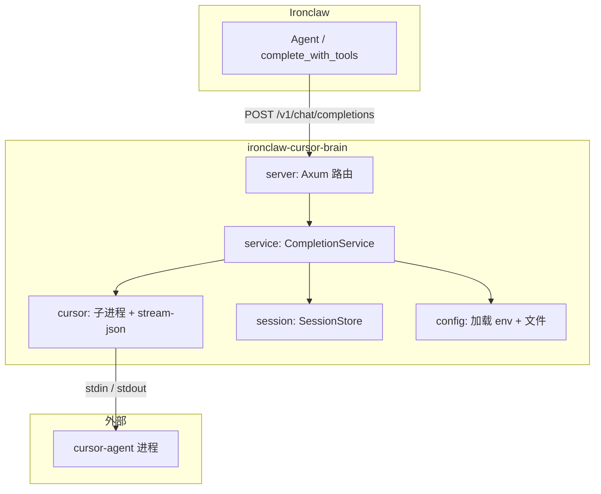
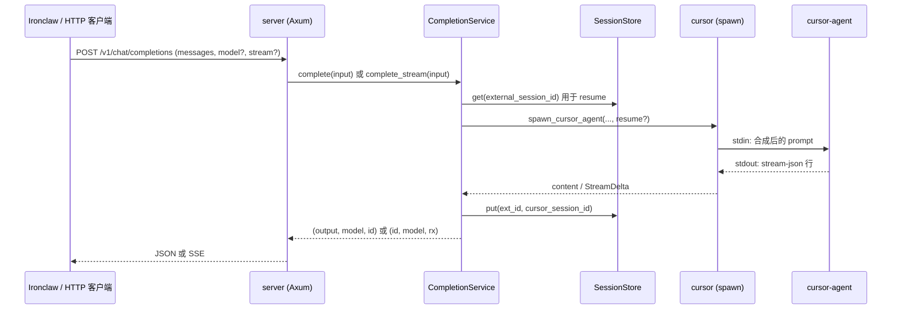

# 架构说明

ironclaw-cursor-brain 是一个 Rust HTTP 服务，将 Cursor Agent 以 OpenAI 兼容 API 的形式暴露给 [Ironclaw](https://github.com/nearai/ironclaw)。

## 组件概览

## 请求流程

## 模块职责

| 模块        | 职责                                                                                                                         |
| ----------- | ---------------------------------------------------------------------------------------------------------------------------- |
| **main**    | 加载配置、绑定服务、优雅退出                                                                                                 |
| **server**  | Axum 路由：`POST /v1/chat/completions`、`GET /v1/models`、`GET /v1/health`；将 `CompletionError` 映射为 HTTP 响应            |
| **service** | 从请求构建 `CompletionInput`；解析 session；通过 cursor 拉起子进程；无内容/回退模型重试；返回结果                            |
| **cursor**  | 启动 cursor-agent 子进程；写入 prompt 到 stdin；从 stdout 解析 stream-json；`run_to_completion` / `run_to_completion_stream` |
| **session** | `SessionStore`：外部 id ↔ cursor session id；`PersistentSessionStore` = LRU + `~/.ironclaw/` 下 JSON 文件                    |
| **config**  | 先读环境变量再读可选文件 `~/.ironclaw/cursor-brain.json`；解析 `cursor_path`（PATH 或平台路径）                              |
| **openai**  | 请求/响应类型；`format_messages_as_prompt`；`build_completion_response`；SSE chunk 辅助                                      |

## 配置与集成

- **配置目录**：与 Ironclaw 一致（`~/.ironclaw/`，Windows 下 `%USERPROFILE%\.ironclaw\`）。详见 [配置](../README.zh-CN.md#configuration)。
- **提供方契约**：[ironclaw-provider-contract.md](ironclaw-provider-contract.md)。提供方定义：[provider-definition.json](provider-definition.json)。

## 数据流摘要

1. **聊天请求** → Server 解析 body + headers → Service 构建 `CompletionInput`（用户消息、模型、是否流式、可选 session id）。
2. **会话** → 若有 `X-Session-Id`，Service 查 cursor session id 用于 resume；运行后写入映射。
3. **Cursor** → Service 调用 `spawn_cursor_agent`，传入 prompt（单条或 `format_messages_as_prompt`）、可选 `--resume`、`--model`；读取 stream-json（session_id、text、result、thinking）；返回 content 或流。
4. **响应** → Server 将输出映射为 OpenAI 风格 JSON 或 SSE。
