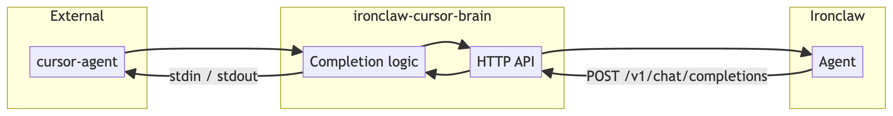
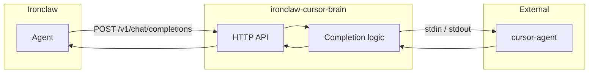
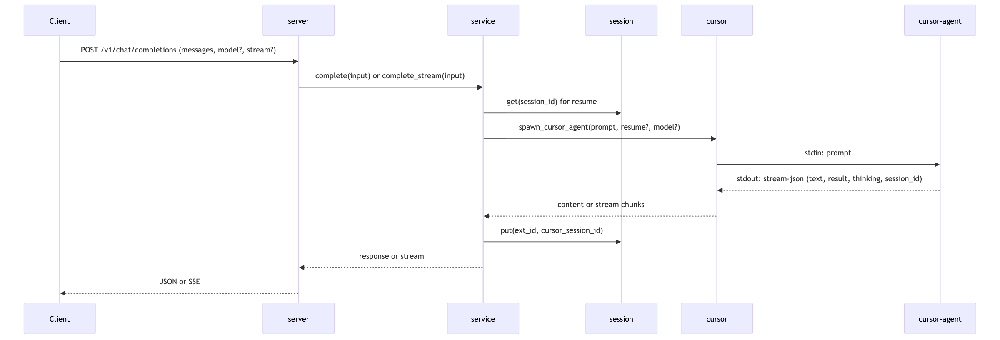
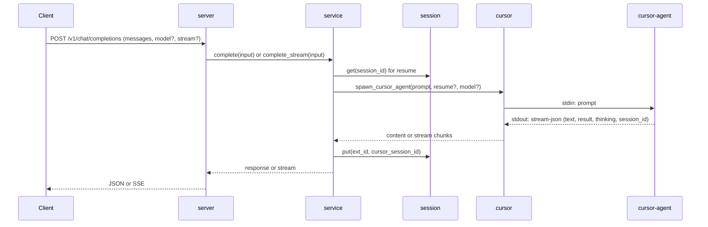

# ironclaw-cursor-brain Guide

A step-by-step guide to understanding and using ironclaw-cursor-brain: architecture, configuration, API, and Ironclaw integration.

**Diagrams:** The figures in this doc are rendered from the Mermaid blocks below. To regenerate PNGs (and SVG) locally, use the [markdown-mermaid-export](https://marketplace.visualstudio.com/items?itemName=MermaidChart.vscode-mermaid-chart) workflow:  
`bash ~/.cursor/skills/markdown-mermaid-export/scripts/markdown-mermaid-export.sh doc/TECHNICAL.md`  
Output: `doc/TECHNICAL-mermaid/Untitled-1.png`, `Untitled-2.png` (and `.svg`).

**Table of contents**

1. [Introduction](#1-introduction)
2. [Quick start](#2-quick-start)
3. [Core concepts](#3-core-concepts)
4. [Request lifecycle](#4-request-lifecycle)
5. [Configuration](#5-configuration)
6. [Sessions](#6-sessions)
7. [API reference](#7-api-reference)
8. [Ironclaw integration](#8-ironclaw-integration)
9. [Appendix: Contract & module reference](#9-appendix-contract--module-reference)

---

## 1. Introduction

### What it is

**ironclaw-cursor-brain** is a small HTTP service that turns the [Cursor Agent](https://cursor.com) (a local subprocess) into an **OpenAI-compatible API**. [Ironclaw](https://github.com/nearai/ironclaw) can then use it as an LLM provider: you add one entry to `~/.ironclaw/providers.json` and use Cursor like any other OpenAiCompletions backend—no changes to Ironclaw’s source code.

### Why use it

- Use Cursor’s models from Ironclaw’s agent/workflow layer.
- Same API shape as OpenAI (chat completions, streaming); easy to swap providers.
- Session continuity: send the same `X-Session-Id` to resume Cursor conversations.
- Zero config by default: optional config file and env overrides.

### What you need

- [Rust](https://rustup.rs) (for `cargo install` or building from source).
- [Cursor](https://cursor.com) (or `cursor-agent` on PATH).
- [Ironclaw](https://github.com/nearai/ironclaw) (for the full stack).

---

## 2. Quick start

Install and run the service:

```bash
cargo install ironclaw-cursor-brain
ironclaw-cursor-brain
```

By default it listens on `http://0.0.0.0:3001`. Add a [provider entry](#8-ironclaw-integration) to `~/.ironclaw/providers.json`, then in Ironclaw choose **Cursor Brain** as the LLM provider. For detailed installation (PostgreSQL, Ironclaw, Windows/macOS/Linux), see the [README § Installation](../README.md#installation).

---

## 3. Core concepts

### High-level architecture

The plugin sits between Ironclaw and the Cursor Agent:

- **Ironclaw** sends HTTP requests (OpenAI-style JSON) to the plugin.
- The **plugin** turns the request into a single prompt, starts **cursor-agent** as a subprocess, feeds the prompt via stdin, and reads stream-json from stdout.
- The plugin maps the agent’s text output back to OpenAI-style JSON or SSE and returns it to Ironclaw.



<details>
<summary>Mermaid source</summary>



</details>

### Components (simplified)

| Layer       | Role                                                                                                              |
| ----------- | ----------------------------------------------------------------------------------------------------------------- |
| **server**  | Axum routes: chat completions, models, health; maps errors to HTTP.                                               |
| **service** | Builds input from the request, manages session (resume), spawns cursor-agent, retries on empty or fallback model. |
| **cursor**  | Spawns the subprocess, writes prompt to stdin, parses stream-json from stdout.                                    |
| **session** | Stores external session id ↔ cursor session id (LRU + file under `~/.ironclaw/`).                                 |
| **config**  | Loads from env and optional `~/.ironclaw/cursor-brain.json`.                                                      |

---

## 4. Request lifecycle

What happens when Ironclaw (or any client) calls `POST /v1/chat/completions`:



<details>
<summary>Mermaid source</summary>



</details>

1. **Parse** — Server parses the body and headers; service builds `CompletionInput`: if `messages.len() > 1` the full conversation is synthesized with `format_messages_as_prompt` (System / User / Assistant / Tool result blocks); otherwise the last user message is taken. Model, stream flag, and optional session header are read from the request.
2. **Resume** — If `X-Session-Id` is set, service looks up the corresponding cursor session id and passes it as `--resume` to the agent.
3. **Run** — Service spawns cursor-agent with the synthesized prompt (and optional `--model`), reads stream-json lines, and collects content (and optionally thinking).
4. **Session** — When the agent sends a `session_id` event, the service stores the mapping (external id → cursor session id) for future resume.
5. **Respond** — Server returns OpenAI-style JSON (non-stream) or SSE (stream).

---

## 5. Configuration

- **Config directory**: Same as Ironclaw: `~/.ironclaw/` (Windows: `%USERPROFILE%\.ironclaw\`).
- **Optional file**: `cursor-brain.json` in that directory is read first (if present); then environment variables override any file values.

| Option                | Description                                                           | Default                                 |
| --------------------- | --------------------------------------------------------------------- | --------------------------------------- |
| `cursor_path`         | Path to cursor-agent binary                                           | Auto-detect from PATH or platform paths |
| `port`                | Listen port                                                           | 3001                                    |
| `request_timeout_sec` | Per-request timeout (seconds)                                         | 300                                     |
| `session_cache_max`   | Session map LRU size                                                  | 1000                                    |
| `session_header_name` | Header for external session id                                        | `x-session-id`                          |
| `default_model`       | Model when request omits `model`                                      | `"auto"`                                |
| `fallback_model`      | Retry with this model if primary returns no content (non-stream only) | —                                       |

**Env vars**: `CURSOR_PATH`, `PORT` or `IRONCLAW_CURSOR_BRAIN_PORT`, `REQUEST_TIMEOUT_SEC`, `SESSION_CACHE_MAX`, `SESSION_HEADER_NAME`, `CURSOR_BRAIN_DEFAULT_MODEL`, `CURSOR_BRAIN_FALLBACK_MODEL`. **Log level**: `RUST_LOG` (e.g. `RUST_LOG=debug ironclaw-cursor-brain`).

---

## 6. Sessions

- Send the same **`X-Session-Id`** (or the header you configured) on each request. The service keeps a mapping: your id → cursor’s session id.
- The next request with the same header uses `--resume` so the agent continues the conversation.
- Mappings are stored in memory (LRU) and persisted to `~/.ironclaw/cursor-brain-sessions.json`. Restarting the service keeps sessions if the file is present.
- If a resumed request returns no content, the service clears that mapping and retries once without resume.

---

## 7. API reference

| Endpoint               | Method | Description                                                                                                                            |
| ---------------------- | ------ | -------------------------------------------------------------------------------------------------------------------------------------- |
| `/v1/chat/completions` | POST   | OpenAI-style body: `model`, `messages`, `stream?`. Supports streaming (SSE) and non-streaming.                                         |
| `/v1/models`           | GET    | Returns model ids from `cursor-agent --list-models` (15s timeout); on failure or timeout returns default `["auto", "cursor-default"]`. |
| `/v1/health`           | GET    | Returns `status` (`ok` or `degraded`), `cursor` (boolean), `port`, `session_storage` (`"file"`).                                       |

- `temperature` and `max_tokens` are accepted but not forwarded to cursor-agent.
- `tools` / `tool_choice` are accepted (for API compatibility) but not sent to the agent; tool results in `messages` are included in the synthesized prompt as “Tool result:” text.

---

## 8. Ironclaw integration

### Register the provider

1. Ensure the service is running (e.g. `ironclaw-cursor-brain`).
2. Add one **ProviderDefinition** object to the array in `~/.ironclaw/providers.json`. You can copy from [provider-definition.json](provider-definition.json).
3. Run `ironclaw onboard` and choose **Cursor Brain** in the LLM step; use the default Base URL `http://127.0.0.1:3001/v1` (or your host/port). No API key required.
4. Set `LLM_BACKEND=cursor` (or an alias like `cursor_brain`) to use this provider.

### Contract in short

- Ironclaw calls `POST {base_url}/chat/completions` with full `messages` (and optionally `tools` / `tool_choice`). The plugin synthesizes messages into one prompt for cursor-agent and returns text in `choices[].message.content` (no `tool_calls`). See [Appendix § Contract](#92-provider-contract) for details.

---

## 9. Appendix: Contract & module reference

### 9.1 Module roles

| Module      | Role                                                                                                   |
| ----------- | ------------------------------------------------------------------------------------------------------ |
| **main**    | Load config, bind server, graceful shutdown.                                                           |
| **server**  | Routes; map `CompletionError` to HTTP status and body.                                                 |
| **service** | Build input, session lookup/update, spawn cursor, retry, return output.                                |
| **cursor**  | Spawn subprocess, stdin/stdout, stream-json parsing; `run_to_completion` / `run_to_completion_stream`. |
| **session** | `SessionStore`: get/put/remove; `PersistentSessionStore` = LRU + JSON file.                            |
| **config**  | Env + optional `cursor-brain.json`; `resolve_cursor_path()`.                                           |
| **openai**  | Request/response types; `format_messages_as_prompt`; `build_completion_response`; SSE helpers.         |

### 9.2 Provider contract

- **How Ironclaw calls the plugin**: `providers.json` with `protocol: "open_ai_completions"`, `default_base_url` with `/v1`. Rig uses `openai::Client`; requests go to `{base_url}/chat/completions`.
- **Request**: `model`, `messages` (system/user/assistant/tool), `stream?`, `temperature?`, `max_tokens?`, `tools?`, `tool_choice?`. Plugin uses messages (and tool results inside them) to build one prompt; `tools` / `tool_choice` are not forwarded.
- **Response**: `choices[].message.content` (text only; no `tool_calls`). Streaming: SSE with `delta.content`.
- **Endpoints**: Same URL and method as above; `GET /v1/models`, `GET /v1/health`. API key not validated when provider has `api_key_required: false`.
