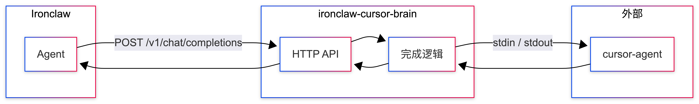
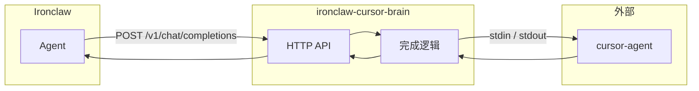
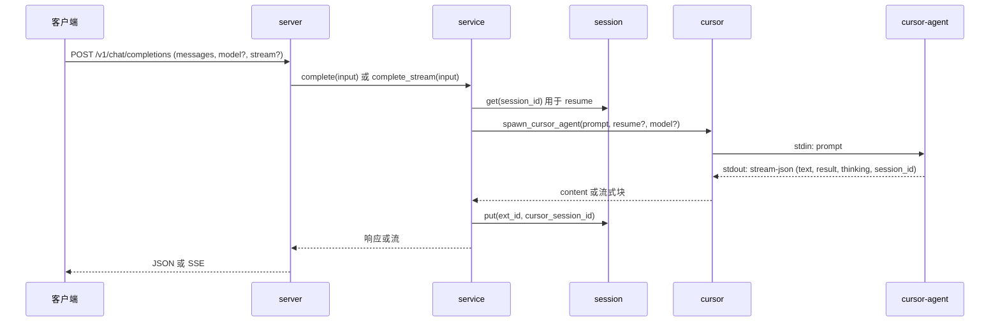

# ironclaw-cursor-brain 使用指南

从零理解并使用 ironclaw-cursor-brain：架构、配置、API 与 Ironclaw 集成。

**图表说明：** 文中配图由下方 Mermaid 代码块渲染得到。本地重新生成 PNG（及 SVG）请使用 [markdown-mermaid-export](https://marketplace.visualstudio.com/items?itemName=MermaidChart.vscode-mermaid-chart) 流程：  
`bash ~/.cursor/skills/markdown-mermaid-export/scripts/markdown-mermaid-export.sh doc/TECHNICAL.zh-CN.md`  
输出目录：`doc/TECHNICAL.zh-CN-mermaid/`（Untitled-1.png、Untitled-2.png 及 .svg）。

**目录**

1. [简介](#1-简介)
2. [快速开始](#2-快速开始)
3. [核心概念](#3-核心概念)
4. [请求生命周期](#4-请求生命周期)
5. [配置](#5-配置)
6. [会话](#6-会话)
7. [API 参考](#7-api-参考)
8. [Ironclaw 集成](#8-ironclaw-集成)
9. [附录：契约与模块说明](#9-附录契约与模块说明)

---

## 1. 简介

### 是什么

**ironclaw-cursor-brain** 是一个小型 HTTP 服务，把本地的 [Cursor Agent](https://cursor.com)（子进程）包装成 **OpenAI 兼容的 API**。[Ironclaw](https://github.com/nearai/ironclaw) 可以把它当作 LLM 提供方使用：在 `~/.ironclaw/providers.json` 里加一条配置，就能像使用其他 OpenAiCompletions 后端一样使用 Cursor，无需改 Ironclaw 源码。

### 为什么用

- 在 Ironclaw 的 agent/工作流里使用 Cursor 的模型。
- 与 OpenAI 相同的 API 形态（chat completions、流式）；便于切换提供方。
- 会话延续：发送相同的 `X-Session-Id` 即可恢复 Cursor 对话。
- 默认零配置：可选配置文件和环境变量覆盖。

### 需要什么

- [Rust](https://rustup.rs)（用于 `cargo install` 或从源码构建）。
- [Cursor](https://cursor.com)（或 PATH 上的 `cursor-agent`）。
- [Ironclaw](https://github.com/nearai/ironclaw)（完整使用时）。

---

## 2. 快速开始

安装并启动服务：

```bash
cargo install ironclaw-cursor-brain
ironclaw-cursor-brain
```

默认监听 `http://0.0.0.0:3001`。在 `~/.ironclaw/providers.json` 中添加 [provider 条目](#8-ironclaw-集成)，然后在 Ironclaw 里选择 **Cursor Brain** 作为 LLM 提供方。详细安装步骤（PostgreSQL、Ironclaw、Windows/macOS/Linux）见 [README § 安装](../README.zh-CN.md#安装)。

---

## 3. 核心概念

### 整体架构

插件位于 Ironclaw 与 Cursor Agent 之间：

- **Ironclaw** 向插件发送 HTTP 请求（OpenAI 风格 JSON）。
- **插件** 将请求转成单条 prompt，启动 **cursor-agent** 子进程，通过 stdin 传入 prompt，从 stdout 读取 stream-json。
- 插件把 agent 的文本输出再转成 OpenAI 风格 JSON 或 SSE 返回给 Ironclaw。



<details>
<summary>Mermaid 源码</summary>



</details>

### 组件（简述）

| 层级        | 作用                                                                         |
| ----------- | ---------------------------------------------------------------------------- |
| **server**  | Axum 路由：chat completions、models、health；将错误映射为 HTTP。             |
| **service** | 从请求构建输入、管理会话（resume）、拉起 cursor-agent、无内容/回退模型重试。 |
| **cursor**  | 启动子进程、写 prompt 到 stdin、从 stdout 解析 stream-json。                 |
| **session** | 存储「外部 session id ↔ cursor session id」（LRU + `~/.ironclaw/` 下文件）。 |
| **config**  | 从环境变量和可选 `~/.ironclaw/cursor-brain.json` 加载。                      |

---

## 4. 请求生命周期

当 Ironclaw（或任意客户端）调用 `POST /v1/chat/completions` 时发生什么：


<details>
<summary>Mermaid 源码</summary>



</details>

1. **解析** — Server 解析 body 和 headers；service 构建 `CompletionInput`：当 `messages.len() > 1` 时用 `format_messages_as_prompt` 合成完整对话（System / User / Assistant / Tool result 段落），否则取最后一条 user 消息。模型、是否流式及可选 session 头从请求中读取。
2. **恢复** — 若带了 `X-Session-Id`，service 查出对应的 cursor session id，以 `--resume` 传给 agent。
3. **执行** — Service 用合成后的 prompt（及可选 `--model`）启动 cursor-agent，读取 stream-json 行，收集 content（及可选 thinking）。
4. **会话** — agent 发出 `session_id` 事件时，service 写入映射（外部 id → cursor session id）供后续 resume。
5. **响应** — Server 返回 OpenAI 风格 JSON（非流）或 SSE（流式）。

---

## 5. 配置

- **配置目录**：与 Ironclaw 相同，`~/.ironclaw/`（Windows：`%USERPROFILE%\.ironclaw\`）。
- **可选文件**：该目录下的 `cursor-brain.json` 若存在会先被读取，再由环境变量覆盖其中的任意项。

| 配置项                | 说明                                       | 默认                       |
| --------------------- | ------------------------------------------ | -------------------------- |
| `cursor_path`         | cursor-agent 可执行路径                    | 从 PATH 或平台路径自动探测 |
| `port`                | 监听端口                                   | 3001                       |
| `request_timeout_sec` | 单次请求超时（秒）                         | 300                        |
| `session_cache_max`   | 会话映射 LRU 容量                          | 1000                       |
| `session_header_name` | 外部 session id 的请求头名                 | `x-session-id`             |
| `default_model`       | 请求未传 `model` 时使用的模型              | `"auto"`                   |
| `fallback_model`      | 主模型无内容时用此模型重试一次（仅非流式） | —                          |

**环境变量**：`CURSOR_PATH`、`PORT` 或 `IRONCLAW_CURSOR_BRAIN_PORT`、`REQUEST_TIMEOUT_SEC`、`SESSION_CACHE_MAX`、`SESSION_HEADER_NAME`、`CURSOR_BRAIN_DEFAULT_MODEL`、`CURSOR_BRAIN_FALLBACK_MODEL`。**日志级别**：`RUST_LOG`（如 `RUST_LOG=debug ironclaw-cursor-brain`）。

---

## 6. 会话

- 每次请求带上相同的 **`X-Session-Id`**（或你配置的 header）。服务会维护「你的 id → cursor 的 session id」的映射。
- 下次带同一 header 的请求会使用 `--resume`，agent 会接着上次对话。
- 映射在内存中（LRU）并持久化到 `~/.ironclaw/cursor-brain-sessions.json`。重启服务后只要该文件存在，会话会保留。
- 若某次 resume 请求返回无内容，服务会清除该映射并再试一次（不传 resume）。

---

## 7. API 参考

| 端点                   | 方法 | 说明                                                                                                             |
| ---------------------- | ---- | ---------------------------------------------------------------------------------------------------------------- |
| `/v1/chat/completions` | POST | OpenAI 风格 body：`model`、`messages`、`stream?`。支持流式（SSE）与非流式。                                      |
| `/v1/models`           | GET  | 通过 `cursor-agent --list-models` 获取模型 id（超时 15 秒）；失败或超时时返回默认 `["auto", "cursor-default"]`。 |
| `/v1/health`           | GET  | 返回 `status`（`ok` 或 `degraded`）、`cursor`（布尔）、`port`、`session_storage`（`"file"`）。                   |

- `temperature`、`max_tokens` 会解析但不转发给 cursor-agent。
- `tools` / `tool_choice` 会接收（兼容 API）但不发给 agent；`messages` 中的工具结果会以「Tool result:」文本形式写入合成 prompt。

---

## 8. Ironclaw 集成

### 注册提供方

1. 确保服务已运行（如 `ironclaw-cursor-brain`）。
2. 在 `~/.ironclaw/providers.json` 的数组中加入一条 **ProviderDefinition** 对象，可从 [provider-definition.json](provider-definition.json) 复制。
3. 运行 `ironclaw onboard`，在 LLM 步骤选择 **Cursor Brain**；Base URL 使用默认 `http://127.0.0.1:3001/v1`（或你的主机/端口）。无需 API Key。
4. 设置 `LLM_BACKEND=cursor`（或别名如 `cursor_brain`）即可使用该提供方。

### 契约简述

- Ironclaw 调用 `POST {base_url}/chat/completions`，携带完整 `messages`（及可选 `tools` / `tool_choice`）。插件将 messages 合成为单条 prompt 发给 cursor-agent，并在 `choices[].message.content` 中返回文本（不返回 `tool_calls`）。细节见 [附录 § 契约](#92-提供方契约)。

---

## 9. 附录：契约与模块说明

### 9.1 模块职责

| 模块        | 职责                                                                                           |
| ----------- | ---------------------------------------------------------------------------------------------- |
| **main**    | 加载配置、绑定服务、优雅退出。                                                                 |
| **server**  | 路由；将 `CompletionError` 映射为 HTTP 状态与 body。                                           |
| **service** | 构建输入、会话查询/更新、启动 cursor、重试、返回结果。                                         |
| **cursor**  | 启动子进程、stdin/stdout、stream-json 解析；`run_to_completion` / `run_to_completion_stream`。 |
| **session** | `SessionStore`：get/put/remove；`PersistentSessionStore` = LRU + JSON 文件。                   |
| **config**  | 环境变量 + 可选 `cursor-brain.json`；`resolve_cursor_path()`。                                 |
| **openai**  | 请求/响应类型；`format_messages_as_prompt`；`build_completion_response`；SSE 辅助。            |

### 9.2 提供方契约

- **Ironclaw 如何调用**：`providers.json` 中 `protocol: "open_ai_completions"`，`default_base_url` 含 `/v1`。Rig 使用 `openai::Client`；请求发往 `{base_url}/chat/completions`。
- **请求**：`model`、`messages`（system/user/assistant/tool）、`stream?`、`temperature?`、`max_tokens?`、`tools?`、`tool_choice?`。插件用 messages（及其中的工具结果）拼成一条 prompt；`tools` / `tool_choice` 不转发。
- **响应**：`choices[].message.content`（仅文本；无 `tool_calls`）。流式：SSE，`delta.content`。
- **端点**：同上 URL 与方法；`GET /v1/models`、`GET /v1/health`。当提供方为 `api_key_required: false` 时不校验 API Key。
